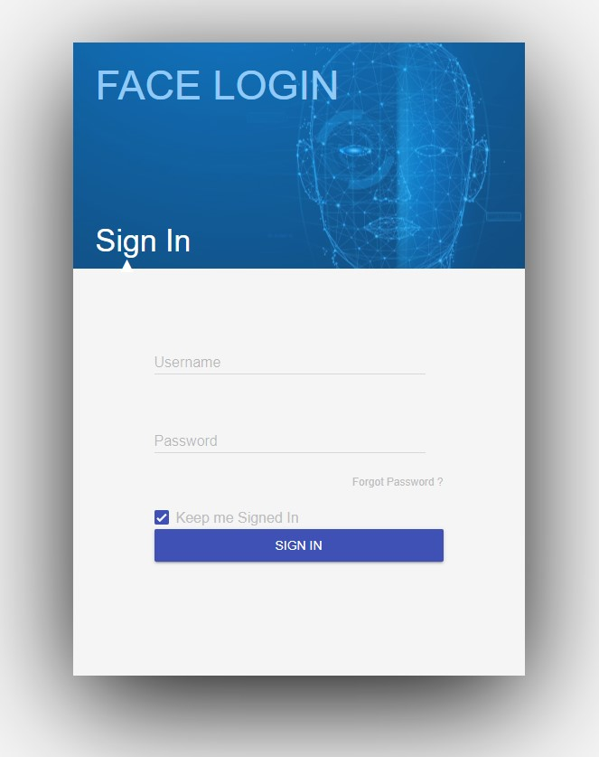
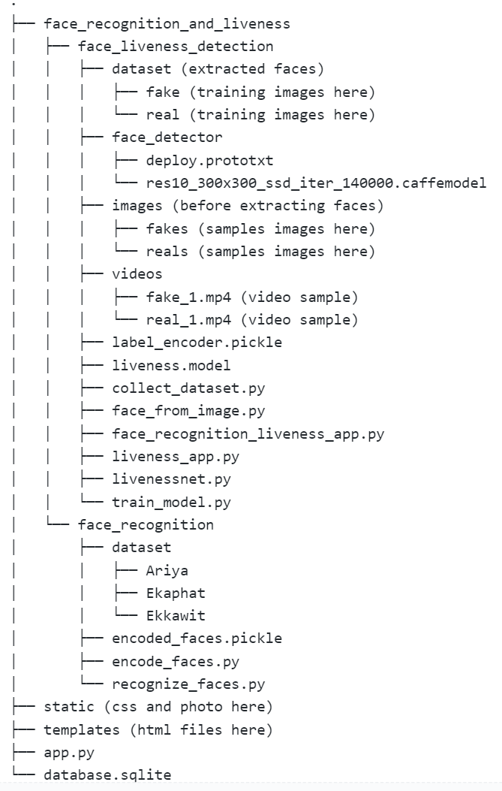

# Face Recognition with Liveness Detection Login on Flask Web application
## Project Overview
&nbsp;&nbsp;&nbsp;&nbsp;We have implemented Flask web application login page including face verification (1-to-1 to verify whether the person who is logging in is really that person), for security purpose, with liveness detection mechanism (to check whether the person detected on the camera is a REAL person or FAKE (eg. image, video, etc. of that person)), for Anti-Spoofting (Others pretending to be the person), built with Convolutional Neural Network. After the login page, we also provided a webpage placeholder for future use.   
  
**Login component:**  
  
  
**Loggin in and running inference process:**  

**Link to full demo on Youtube (recommend watching):** https://www.youtube.com/watch?v=2S-HmiPNViU 

## Result
* The face recognition works well detecting face and accurately recognizing the face.
* The liveness detection works well with classifying fake images and videos from smartphone spoofing.
* The liveness detection is also trained to be able to classify solid-printed images (image on papers and cards). But it's trained only with around 10 images, so it doesn't work well everytime (read "Full Workflow usage and Training your own model" section, in case you want to train it yourself with bigger dataset)

## Packages and Tools
Use requirements.txt if you want to install the correct version of packages.
- OpenCV
- TensorFlow 2
- Scikit-learn
- Face_recognition
- Flask
- SQLite
- SQLAlchemy (for Flask)

## Project structure
(no need to care about "assets" folder, it's just images for GitHub)  
  

## Files explanation
&nbsp;&nbsp;&nbsp;&nbsp;In this section, we will show how to use/execute each file in this repo. The full workflow of the repo, from the data collection till running the web application, will be provided step-by-step in the next section.  
*Note: All files have code explanation in the source code themselves*
* In **main** folder (main repo)
  * **`app.py`**: This is the main Flask app. To use it, just normally run this file from your terminal/preferred IDE and the running port for your web app will be shown. **If you want to deploy this app, don't forget to change app.secret_key variable**
  * **`database.sqlite`**: This is the minimum example of database to store user's data and it is used to retrieve and verify while user is logging in.  
* In face_recognition_and_liveness/**face_recognition** folder
  * **`encode_faces.py`**: Detect the face from images, encode, and save encoded version and name (label) to pickle files. **The name/label coms from the name of folder of those input images.**  
    Command line argument:
    * `--dataset (or -i)` Path to input directory of images
    * `--encoding (or -e)` Path/Directory to save encoded images pickle files
    * `--detection-method (or -d)` Face detection model to use: 'hog' or 'cnn' (default is 'cnn')  
    **Example**: `python encode_faces.py -i dataset -e encoded_faces.pickle -d cnn`  
  * **`recognize_faces.py`**: Real-time face recognition on webcam with bounding boxes and names showing on top.  
    Command line argument:
    * `--encoding (or -e)` Path to saved face encodings
    * `--detection-method (or -d)` Face detection model to use: 'hog' or 'cnn' (default is 'cnn')  
    **Example**: `python recognize_faces.py -e encoded_faces.pickle -d cnn`
  * **`dataset`** folder: Example folder and images to store dataset used to do face encoding. There are subfolders in this folder and each subfolder must be named after the owner of image in that subfolder because this subfolder name will be used as a label in face encoding process.
* In face_recognition_and_liveness/**face_liveness_detection** folder
  * **`collect_dataset.py`**: Collect face in each frame from a *video* dataset (real/fake) using face detector model (resnet-10 SSD in this case) and save to a directory (we provided a video example in videos folder, so you can collect the correct video dataset to train the model)  
    Command line argument:
    * `--input (or -i)` Path to input input video
    * `--output (or -o)` Path/Directory to output directory of cropped face images
    * `--detector (or -d)` Path to OpenCV\'s deep learning face detector  
    * `--confidence (or -c)` Confidence of face detector model (default is 0.5 | 50%)
    * `--skip (or -s)` Number of frames to skip before applying face detection and crop (dafault is 16). The main idea for this is the consequence frames usually give the same face to the dataset, so it can easily causes overfitting and is not a useful data for training.  
    **Example**: example for *fake video* dataset -> `python collect_dataset.py -i videos/fake_1.mp4 -o dataset/fake -d face_detector -c 0.5 -s 15` | example for *real video* dataset -> `python collect_dataset.py -i videos/real_1.mp4 -o dataset/real -d face_detector -c 0.5 -s 15`
  * **`face_from_image.py`**: Collect face in each frame from a *image* dataset (real/fake) using face detector model (resnet-10 SSD in this case) and save to a directory (we provided a video example in videos folder, so you can collect the correct video dataset to train the model)  
    Command line argument:
    * `--input (or -i)` Path to input input image (A single image | Since we mainly collect dataset from videos, we use this code only to collect face from those solid-printed picture (picture from paper/card) and we didn't have many of them. So, we make the code just for collect face from 1 image. Feel free to adjust the code if you want to make it able to collect faces from all image in a folder/directory)
    * `--output (or -o)` Path/Directory to output directory of cropped face images
    * `--detector (or -d)` Path to OpenCV\'s deep learning face detector  
    * `--confidence (or -c)` Confidence of face detector model (default is 0.5 | 50%)  
    **Example**: example for *fake image* dataset -> `python face_from_image.py -i images/fakes/2.jpg -o dataset/fake -d face_detector -c 0.5` | example for *real image* dataset -> `python face_from_image.py -i images/reals/1.jpg -o dataset/real -d face_detector -c 0.5`
  * **`livenessnet.py`**: Model architecture for our liveness detection model and build function to build the neural network (there is no command line arguement for this file (no need to do that)). The class *LivenessNet* will be called from the `train_model.py` file in order to build a model and run the training process from train_model.py file.
  * **`train_model.py`**: The code used to train the liveness detection model and output .model, label_encoder.pickle, and plot.png image files.  
    Command line argument:
    * `--dataset (or -d)` Path to input Dataset
    * `--model (or -m)` Path to output trained model
    * `--le (or -l)` Path to output Label Encoder 
    * `--plot (or -p)` Path to output loss/accuracy plot  
    **Example**: `python train_model.py -d dataset -m liveness.model -l label_encoder.pickle -p plot.png`
  * **`liveness_app.py`**: Run face detection, draw bounding box, and run liveness detection model real-time on webcam  
    Command line argument:
    * `--model (or -m)` Path to trained model
    * `--le (or -l)` Path to Label Encoder
    * `--detector (or -d)` Path to OpenCV\'s deep learning face detector  
    * `--confidence (or -c)` Confidence of face detector model (default is 0.5 | 50%)  
    **Example**: `python liveness_app.py -m liveness.model -l label_encoder.pickle -d face_detector -c 0.5`
  * **`face_recognition_liveness_app.py`**: This is the **core** file combined both face recognition and liveness detection together and run them concurrently. The current version of this file is refactored in order to use in the main `app.py` file, so this file **doesn't support command line arguements**. **However**, we have provided the code for command line inside the source code itself and commented those lines. If you really want to run in completely from command line, uncomment those lines and comment out the function structure (header, return, and if \_\_name\_\_ == '\_\_main\_\_') and that's it. In case you want to run from command line, we will provide the command line arguement and example here.  
    **Example if you don't modify the code**: `python face_recognition_liveness_app.py`  
    Command line argument:
    * `--model (or -m)` Path to trained model
    * `--le (or -l)` Path to Label Encoder
    * `--detector (or -d)` Path to OpenCV\'s deep learning face detector  
    * `--confidence (or -c)` Confidence of face detector model (default is 0.5 | 50%)  
    * `--encodings (or -e)` Path to saved face encodings  
    **Example if you modify the code and use command line argument**: `python face_recognition_liveness_app.py -m liveness.model -l label_encoder.pickle -d face_detector -c 0.5 -e ../face_recognition/encoded_faces.pickle`
  * **`dataset`** folder: Example folder and images for training liveness detection model. (These images are outputs of `collect_dataset.py`)
  * **`face_detector`** folder: The folder containing the caffe model files including .prototxt and .caffemodel to use with OpenCV and do face detection
  * **`images`** folder: Example folder and images for inputting to `face_from_image.py`
  * **`videos`** folder: Example folder and videos for inputting to `collect_dataset.py`

## Basic usage
1. Download/Clone this repo
2. Run app.py
3. That's it!  
  
**Note: Doing only these steps will allow only Liveness detection to work but not Recognition and Full login mechanism (for full workflow and training our own model, please keep reading and follow the next section)**

## Full Workflow usage and Training your own model
**We'll start with face recognition (step 1-5) and we'll do face liveness detection next (step 6-13). Finally, we'll combine everything together (step 14 til the end)**
1. Create 1 folder for 1 person and name after the person's name in *face_recognition/dataset* (you can take a look at this folder in this repo for example)
2. Collect the images showing full face (1 face per 1 image per 1 person). Since we are using **1 shot learning** technique, collect only up to 10 images for each person would be enough.
3. Run `encode_faces.py` like the example above in files explanation section
4. Now you should get encoded faces file ending with .pickle in the path you specify (if you follow the code above, you should see it in the same folder with this file)
5. Run `recognize_faces.py` like the example above in files explanation section and see whether it works well.
6. Collect video of yourself/others in many light condition (the easiest way to do this is to film yourself/others walking around your/others home) and save to *face_liveness_dection/videos* folder. *The length of the video depends on you.* You don't need to name it with the word 'real' or 'fake'. It's just convention that we found helpful when calling from other codes. **Take a look into that folder, we have dropped some example videos there.**
7. Use those recorded videos and play it on your phone. Then, hold your phone and face the phone screen (running those recorded videos) to the webcam and record your PC/laptop screen. By doing this, you are creating the dataset of someone spoofing the person in the video / pretending to be the person in the video. Try to make sure this new spoofing video has the same length (or nearly) as the original one because we need to avoid *unbalanced dataset*. **Take a look into that folder, we have dropped some example videos there.**
8. Run **`collect_dataset.py`** like the example above in files explanation section for every of your video. Make sure you save the output into the right folder (should be in `dataset` folder and in the right label folder `fake` or `real`). Now you must see a lot of images from your video in the output folder.
9. (Optional, but good to do in order to improve model performance) Take a picture of yourself/others from a paper, photo, cards, etc. and save to *face_liveness_detection/images/fakes*. **Take a look into that folder, we have dropped some example videos there.**
10. If you do step 9, please do this step. Otherwise, you can skip this step. Take more pictures of your face / others' face **in the same amount of the fake images you taken in step 8** and save to *face_liveness_detection/images/reals*. Again, by doing this, we can avoid *unbalanced dataset*. **Take a look into that folder, we have dropped some example videos there.**
11. (Skip this step if you didn't do step 9) Run **`face_from_image.py`** like the example above in files explanation section for every of your image in images folder. Make sure you save the output into the right folder (should be in `dataset` folder and in the right label folder `fake` or `real`). *Note: Like we discussed in files explanation section, you have to run this code 1 image at a time. If you have a lot of images, feel free to adjust the code. So you can run only once for every of your image. (But make sure to save outputs to the right folder)*
12. Run **`train_model.py`** like the example above in files explanation section. Now, we should have .model, label encoder file ending with .pickle, and image in the output folder you specify. If you follow exact code above in files explanation, you should see liveness.model, label_encoder.pickle, and plot.png in this exact folder (like in this repo).
13. Run **`liveness_app.py`** like the example above in files explanation section and see whether it works well. If the model always misclassify, go back and see whether you save output images (real/fake) in the right folder. If you are sure that you save everything in the right place, collect more data or better quality data. *This is the common iterative process of training model, don't feel bad if you have this problem.*
14. Run **`face_recognition_liveness_app.py`** like the example above in files explanation section and see whether it works well. The window should show up for a while with bounding box having your name on top and whether real or fake with probability. If your code work properly, this window will be closed automatically after the model can **detect you and you are real** for **10 consequence frames**. By specifying this 10 consequence frames, it can make sure that the person on the screen is really that person who is logging in and real, not just by accident that the model misclassifies for some frames. It also allows some room for model to misclassify. You can adjust this number in **line 176 'sequence_count' variable** in the code, if you want it to be longer or shorter. And right after the window closes, we should see your name and label (real) on the command line/terminal.
15. In **`app.py`**, in the main folder of this project, go down to **line 56** and so on. Uncomment those lines and change the parameters in *Users* object to your username, password, and name. If you want more column go to **line 13** and add more in there.  **IMPORTANT NOTE:** The name you save here in name column in this database **MUST MATCH** the name that you train your face recognition model in steps above (put in simple, must match the folder name inside *face_recognition/dataset*) unless the login mechanism is not going to work.
16. Run `app.py` and go to the port that it's displaying on your command line/terminal. Test everything there, the login mechanism, face recognition, and face liveness detection. It must work fine by now. *Note: Our web page has no return button to go back. So you must change the URL directly if you want to go back*
17. (Optional) If you're capable of writing some basic SQL query, we recommend opening `database.sqlite` file and take a look at *Users* table to verify whether your data is added correctly.
18. **IMPORTANT** After running `app.py` for the first time, go to those adding users to database section in **line 56** and so on that you add in step 15, and comment out all line that you added. The point of doing this is to not adding the same data to the database table which can cause error. (SQL term: the primary key which is username must be unique)
19. Congratulations! You've done everything :D

## Hope you find our project exciting and useful more or less :D

## What can be improved
- Collect more data in many light conditions and from different genders/ethnics to improve the model (it turned out light intensity and condition play a big role here)
- Connect this login web template to the real app.
- Implement more login mechanism

## Problems we've found
All login mechanism work properly, but sometimes OpenCV camera doesn't show up when calling a function from app.py or when logging in. But restarting app.py once or twice always solves the problem.

## Amazing resources I have learned from
- https://www.pyimagesearch.com/2018/06/18/face-recognition-with-opencv-python-and-deep-learning/
- https://www.pyimagesearch.com/2019/03/11/liveness-detection-with-opencv/
- https://www.youtube.com/watch?v=2Zz97NVbH0U&t=790s  
  
**image in the log in page:** https://www.welivesecurity.com/wp-content/uploads/2019/12/face-scanning-1-e1575541339743.jpg?h=660&la=en&w=1170

# Thank you for reading til the end. YOU ARE AMAZING!!! :D

